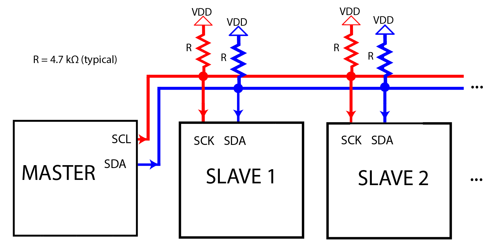

#### Objective

The objective of this experiment is to simulate and understand the **master–slave communication model** using the **I2C (Inter-Integrated Circuit)** protocol with Arduino microcontrollers.

This experiment aims to help learners understand **serial communication concepts**, **device addressing**, and **data transfer mechanisms** between multiple devices connected on a shared communication bus, which is widely used in embedded systems and IoT applications.

#### Introduction

In modern embedded systems, communication between multiple devices such as sensors, memory modules, and display units is essential for building scalable and modular systems. Connecting each device using separate data lines increases hardware complexity, wiring cost, and power consumption.

To overcome these challenges, **serial communication protocols** are used, which allow multiple devices to communicate using a minimal number of wires. One such widely adopted protocol is **I2C (Inter-Integrated Circuit)**, which was originally developed for short-distance communication between integrated circuits on the same circuit board.

This experiment demonstrates I2C-based communication between two Arduino boards, where **one Arduino operates as a Master** and **another operates as a Slave**. Through this experiment, learners gain practical understanding of multi-device communication using a shared bus architecture.

#### Need for Master–Slave Communication

In complex embedded and IoT systems:

- Multiple peripheral devices need to communicate with a central controller  
- Sensors and modules operate independently  
- Coordinated and synchronized data exchange is required  

The **master–slave communication model** addresses these requirements by:

- Allowing a **single master device** to control communication  
- Enabling **multiple slave devices** to respond only when addressed  
- Preventing data collisions on the communication bus  
- Ensuring organized and deterministic data transfer  

This model is especially useful in systems where one microcontroller controls several sensors or peripherals.

#### Overview of I2C Protocol

I2C is a **synchronous, serial communication protocol** that uses only **two wires** for communication:

- **SDA (Serial Data Line)** – Used to transmit and receive data  
- **SCL (Serial Clock Line)** – Used to synchronize data transfer  

##### Key Features of I2C

- Supports **multiple masters and multiple slaves**  
- Uses **device addressing** to select slaves  
- Operates over short distances  
- Requires **pull-up resistors** on SDA and SCL lines  
- Low hardware complexity  

Due to these features, I2C is extensively used for connecting sensors, displays, EEPROMs, and RTC modules.

  

#### I2C Bus Architecture

In an I2C system, all devices are connected to the same **SDA** and **SCL** lines, forming a shared communication bus.

##### Key Characteristics of I2C Bus Architecture

- Uses **open-drain (open-collector)** configuration  
- Pull-up resistors maintain the bus in HIGH state  
- Devices actively pull the line LOW to transmit data  
- Multiple devices can safely share the same bus  

This architecture allows flexible expansion of devices without adding extra communication lines.

  

#### Master and Slave Roles in I2C Communication

##### I2C Master

The master device controls the entire communication process. Its responsibilities include:

- Initiating communication  
- Generating the clock signal on SCL  
- Sending the slave address  
- Controlling data transmission and reception  
- Terminating communication  

##### I2C Slave

The slave device responds only when addressed by the master. Its responsibilities include:

- Monitoring the bus for its address  
- Sending or receiving data as requested  
- Acknowledging successful communication  

In this experiment:
- One Arduino is configured as an **I2C Master**  
- Another Arduino is configured as an **I2C Slave**  

#### I2C Addressing Mechanism

Each I2C slave device is assigned a **unique address** that allows the master to select the intended device.

##### Addressing Features

- Typically uses **7-bit addressing**  
- Supports up to **127 slave devices**  
- Address is sent by the master before data transfer  
- Includes a **Read/Write (R/W) bit**  

Addressing ensures that only the selected slave responds, while other devices remain inactive on the bus.

#### I2C Communication Sequence

A typical I2C data transfer follows a well-defined sequence:

1. **Start Condition**  
   The master pulls SDA LOW while SCL is HIGH, indicating the start of communication.

2. **Slave Address + R/W Bit**  
   The master sends the address of the slave along with the read/write bit.

3. **Acknowledge (ACK)**  
   The addressed slave pulls SDA LOW to acknowledge successful reception.

4. **Data Transfer**  
   Data is exchanged between master and slave in bytes.

5. **Stop Condition**  
   The master releases SDA while SCL is HIGH, ending communication.

This sequence ensures reliable and synchronized data exchange.

  

#### Arduino and I2C Communication

Arduino supports I2C communication using the **Wire library**, which abstracts the low-level protocol details.

##### Key Features of Arduino I2C Support

- SDA and SCL pins are predefined on Arduino boards  
- Wire library handles clock generation and timing  
- Simplifies both master and slave programming  

Arduino can be configured as:
- **I2C Master**  
- **I2C Slave**  
- Both (in advanced multi-master systems)  

This makes Arduino suitable for rapid prototyping of I2C-based systems.

#### Advantages of I2C Protocol

- Uses only **two communication wires**  
- Supports **multiple devices on the same bus**  
- Simple hardware and wiring requirements  
- Widely supported by sensors and display modules  
- Low power consumption  

These advantages make I2C ideal for embedded and IoT applications with limited resources.

#### Limitations of I2C Protocol

Despite its advantages, I2C has certain limitations:

- Limited communication distance  
- Lower data transfer speed compared to SPI  
- Shared bus may reduce performance with many devices  

Understanding these limitations helps designers choose the appropriate communication protocol.

#### Applications of I2C Communication

I2C is widely used in embedded systems for:

- Sensor networks  
- EEPROM and memory communication  
- Real-Time Clock (RTC) modules  
- LCD and OLED displays  
- Multi-microcontroller systems  

#### Conclusion

This experiment provides a detailed understanding of master–slave communication using the I2C protocol with Arduino microcontrollers. By studying bus architecture, addressing, and communication sequences, learners gain essential knowledge required to design reliable multi-device embedded and IoT systems.

#### References

1. I2C Bus Specification and User Manual – NXP Semiconductors  
2. Arduino Wire Library Documentation – https://www.arduino.cc  
3. Embedded Systems Design – Raj Kamal  
4. Serial Communication Protocols – IEEE Publications  
5. Microcontroller Communication Systems – Mazidi  

